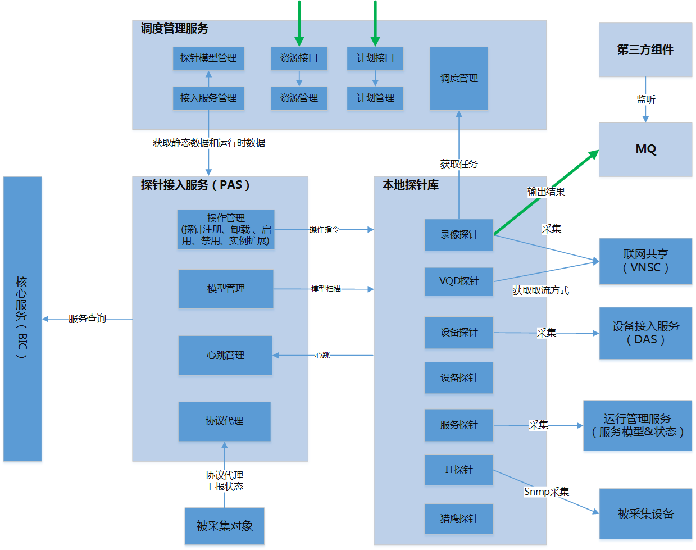
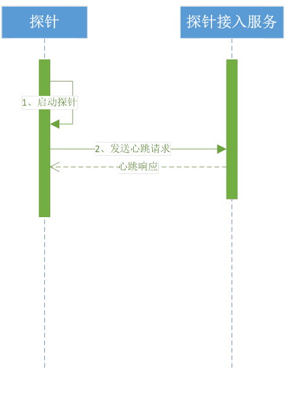
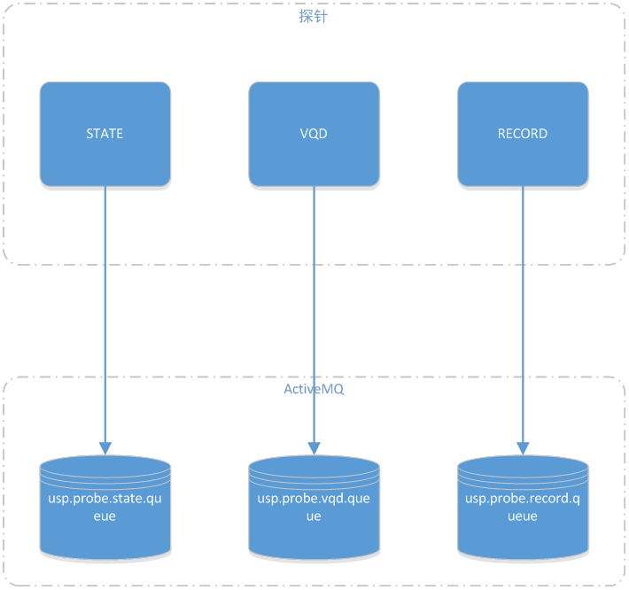
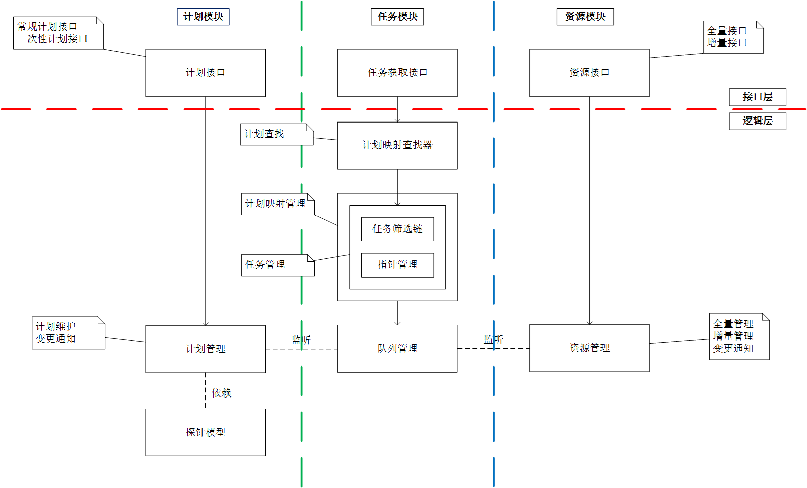
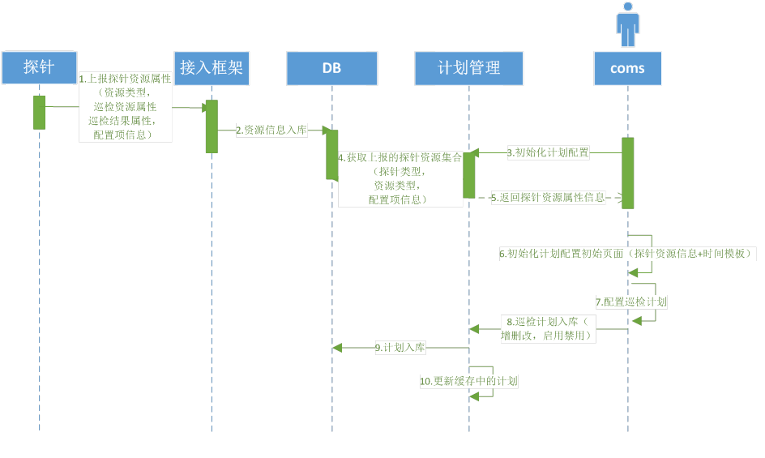
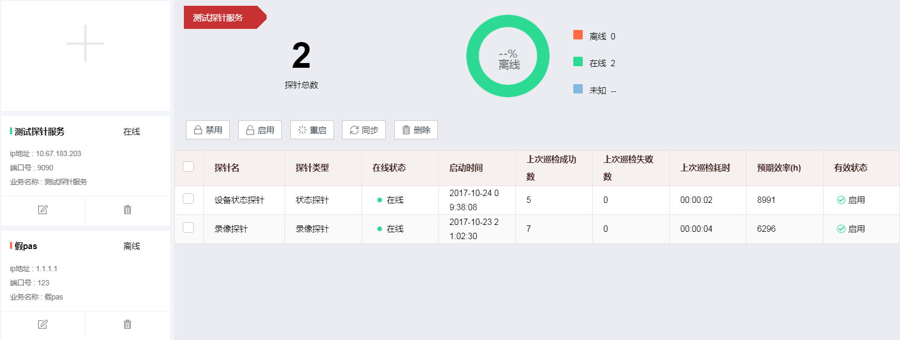
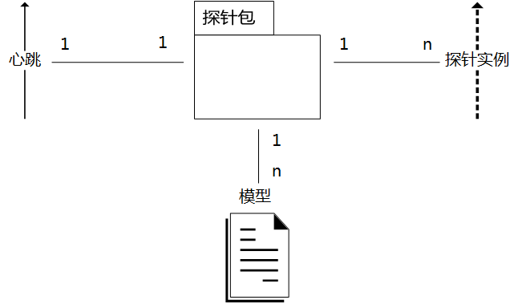

# 探针接入框架

[TOC]

## 1 目标

探针接入框架，简称PAF（Probe Access Framework），旨在针对运维需求，提供统一、灵活、高可用的**数据采集**方案，实现使用运维数据辅助决策的目标。


## 2 架构设计

### 2.1 系统组成

**探针**

针对某类资源类型，执行数据采集功能的组件。

**探针接入框架**

对采集任务进行调度并对探针进行管理，最终完成数据采集任务的软件系统。


总体设计架构图如下：




### 2.2 探针设计

探针是设计应该尽量满足以下需求：

- 轻量级：无状态，尽量不维护采集任务，在需要的时候才去采集信息。
- 独立性：多个探针独立运行独立管理，单个探针的运行不影响其他探针的运行
- 少端口：海外需求要求尽量少开端口，而由于设计上探针的轻量级，业务扩展导致探针增多，以为者端口的增多
- 高效采集

基于上述需求，探针被设计为**不限制实现方式的无端口独立进程**。作用上等效于一个服务接口，输入任务信息，输出采集信息。其任务来源与任务调度模块，其输出为消息队列。


#### 2.2.1 探针模型

探针模型是探针元数据，用于描述探针的名称，功能，所需资源类型，配置项以及输出信息。下面是录像探针的模型示例：

```xml
<?xml version="1.0" encoding="UTF-8"?>
<probe type="record" version="1.0.0"> 
<!-- 约束一个探针仅支持一个业务 -->  
  <!-- 名字 -->  
  <name>录像探针</name>  
  <!-- 描述 -->  
  <description>用于巡检监控点录像完整情况的探针，支持设备类型：监控点</description>  
  <!-- 提供者 -->  
  <provider>共享运维</provider>
  <!-- 巡检输入 -->  
  <!--
    基础资源类型为与核心服务保持一致，事业部特殊业务资源类型按照规范定义
    key可选，未填写表示全部字段，填写表示指定字段
  -->
  <inputs>
    <input resource="camera" key="indexCode"/> 
  </inputs>
  <!-- 巡检输出 -->
  <!--
    number, string, date, list
    -->
  <outputs>
  </outputs>
    <!-- 配置模型 -->  
    <!--
    number, string, date, multi, single
    -->
    <configs> 
     <config key="recordConfig" type="dateoffset" default="1" displayKey="probe.config.record.recordConfig">
		</config>
    </configs>

    <!-- 监听事件名，用于巡检信息主动上报时PAS进行消息分发 -->  
    <events>
    </events>
</probe>
```

#### 2.2.2 心跳

探针心跳是指探针启动成功后，定时向探针接入服务发送心跳请求，来监控各个探针的运行情况。心跳内容包含：探针编号、探针启动时间、各类运行时数据。




####2.2.3 采集数据

探针的采集行为不做约束，可以自己实现协议进行数据采集，也可以依赖已有的底层组件获取数据。例如IT设备探针基于snmp协议进行采集，而视频设备状态探针依赖于设备接入框架（DAC）提供的数据。

采集信息的上报使用消息队列，支持多种消息组件可配，队列名使用业务名，例如




#### 2.2.4 探针目录规范

探针目录遵循一定规范，用于管理服务在扫描时判定探针的有效性。举个栗子：

```
foo
|__bin
	|__start.bat
	|__stop.bat
|__conf
	|__probe.xml
	|__config.properties
|__log
```

其中foo是探针目录结构，下面包括以下几个目录：

- bin：探针的可执行文件目录，必须包含start.bat/sh和stop.bat/sh用于启用和禁用。另外还包含探针服务所需可执行文件，例如java探针的可执行jar就放在这个目录
- conf：探针配置目录，必须要包含模型文件probe.xml和配置文件config.properties。
- log：日志目录


### 2.3 调度模块设计

调度需要考虑任务的特性，基本需求可以分为以下几类：

- 实时任务：仅最大努力，以最小的停顿间隔进行采集。
- 定时任务：定点或者定频进行采集
- 一次性任务：高优先级执行一次性巡检任务


流程如下：



### 2.4 通信模块设计


### 2.5 资源管理设计

由于采集框架不能解释具体业务，因此资源定义不能包含任何业务字段。一条资源包括以下几个字段：

| 列名           | 说明                      |
| ------------ | ----------------------- |
| indexCode    | 资源唯一标识                  |
| resourceType | 资源类型，框架不做业务解释           |
| attributes   | 属性，key-value格式，框架不做业务解释 |

对应探针模型声明的资源类型和属性列，任务生成时资源将被过滤处理。

#### 2.5.1 全量同步


#### 2.5.2 增量同步


### 2.6 计划管理设计

计划模块根据已注册探针类型，各类型探针支持的资源类型，巡检时的配置项信息，与时间模板生成计划的配置页面，对计划进行各项操作（新增，删除，修改，启用，禁用）




### 2.7 集群管理设计





#### 2.7.1 探针的包、实例与服务




#### 2.7.2 探针包管理


#### 2.7.3 探针包部署


#### 2.7.4 探针包服务管理


## 3 设计不足分析

### 3.1 探针

**探针运行机制**

- 运行机制导致外部无法监控和干涉
- 无法主动调度，只能依靠优先级手段，使这个任务今早完成，线路略曲折
- 尽最大努力的采集模式，无法控制采集频率，只能通过调度服务返回任务的接口来，但会产生大量返回空任务的请求。


**探针模型**

- 不支持多业务模型
- 输出模型如何定义

**探针心跳**

- 心跳与多模型关系

**探针输出**

- 考虑兼容集中可配的目的地，例如TLQ，ActiveMQ，Kafka等


### 3.2 调度管理服务

#### 3.2.1 调度服务

**任务调度**

- 服务有状态，尤其是任务队列分发过程维护的指针信息，在实现集群部署时此类信息较难在集群中转移。
- 当资源数量和探针数量巨大时，调度管理服务存在潜在性能问题。


**计划管理**

- 按类型与按点位配置的兼容


#### 3.2.2 管理服务

探针包与探针实例

- 探针包管理方式：探针包库管理，远程部署，删除，默认起停配置
- 单探针包多实例
- ​


## 4 完成情况