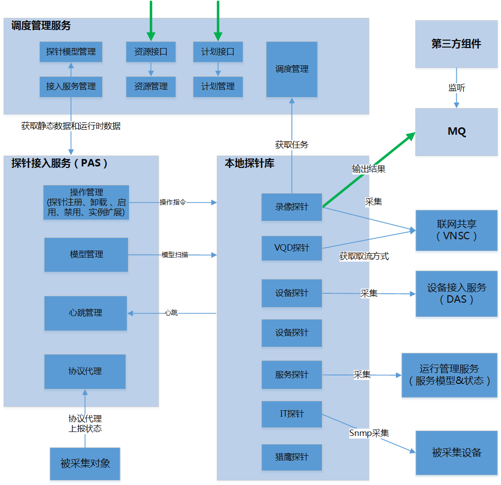

# 探针接入框架

## 1 目标

探针接入框架，简称PAF（Probe Access Framework），旨在针对运维需求，提供统一、灵活、高可用的**数据采集**方案，实现使用运维数据辅助决策的目标。

## 2 架构设计

### 2.1 系统组成

**探针**

针对某类资源类型，执行数据采集功能的组件。

**探针接入框架**

对采集任务进行调度并对探针进行管理，最终完成数据采集任务的软件系统。

总体设计架构图如下：

### 2.2 探针设计

#### 2.2.1 探针模型

探针是设计应该尽量满足以下需求：

- 轻量级：无状态，尽量不维护采集任务，在需要的时候才去采集信息。作用上等效于一个服务接口，输入任务信息，输出采集信息
- 独立性：多个探针独立运行独立管理，单个探针的运行不影响其他探针的运行
- 少端口：海外需求要求尽量少开端口，而由于设计上探针的轻量级，业务扩展导致探针增多，以为者端口的增多
- 高效采集

基于上述需求，探针被设计为独立进程，不限制实现方式，无端口的小程序。其任务来源与任务调度模块，其输出为MQ。

### 2.3 调度模块设计

调度设计需要考虑任务的特性，基本需求可以分为以下几类：

- 实时任务
- 定时任务
- 一次性任务

流程如下：

### 2.4 通信模块设计

### 2.5 资源管理设计

### 2.6 计划管理设计

### 2.7 集群管理设计

## 3 设计缺陷分析

## 4 完成情况